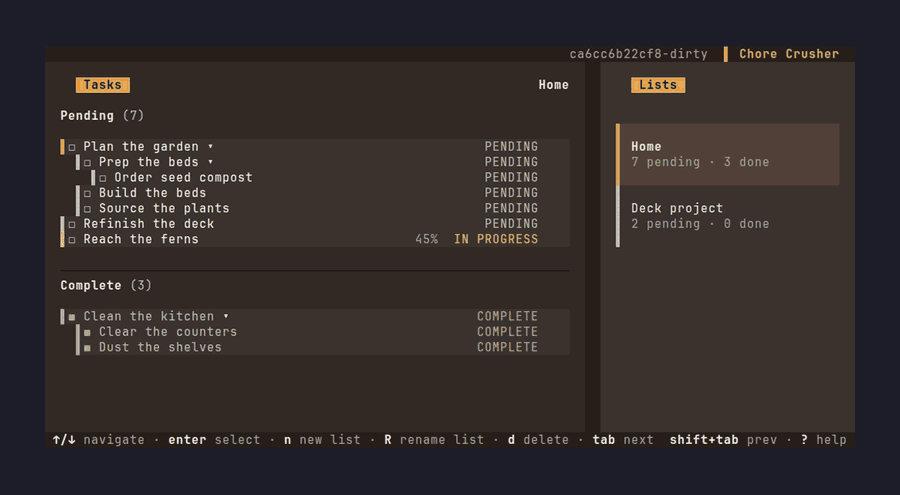
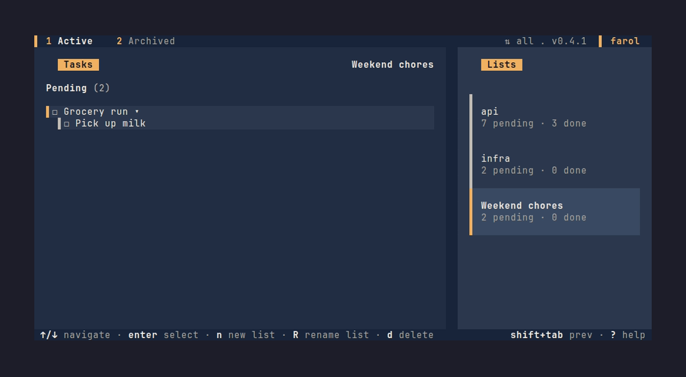
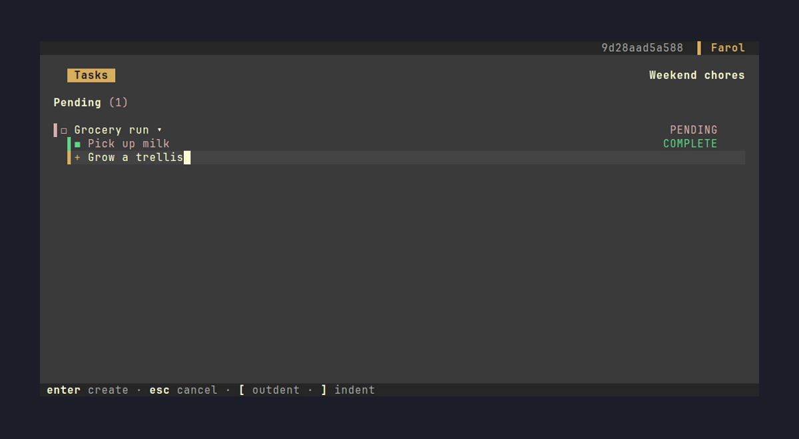
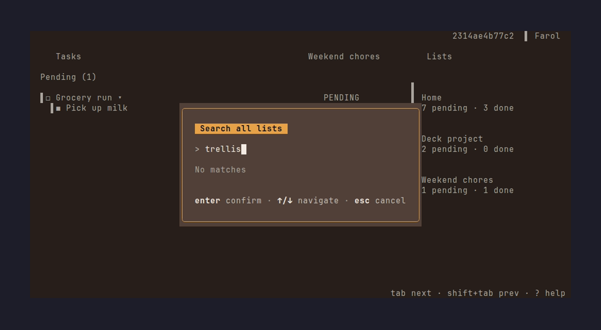
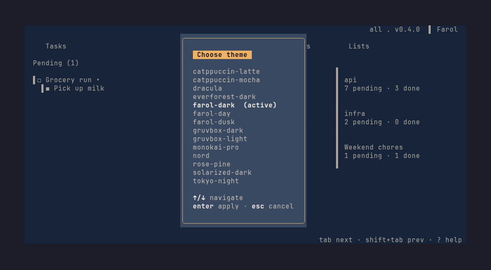
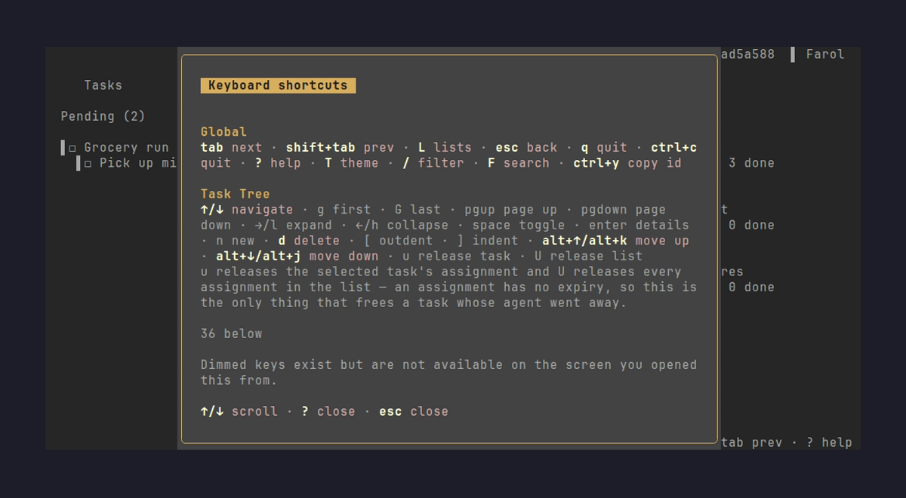
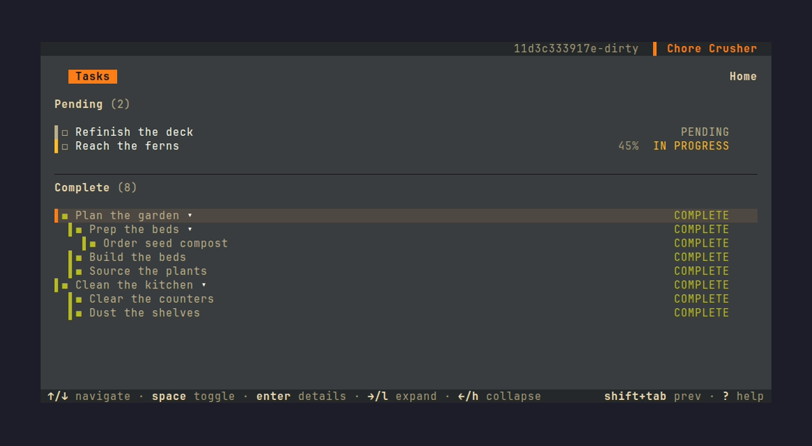

# Chore Crusher

**A terminal to-do list you can watch, and your coding agent can drive.**


[**Demo**](#demo) • [**Get Started**](#get-started) • [**Usage**](#usage) • [**For Agents**](#for-coding-agents)

---

## Demo



## Features

- **Watch an agent work.** Leave the TUI open in a pane while
  Claude Code, Pi, or a shell script adds, completes, and updates tasks.
  Watch it happen live. When an agent claims a task, you see **which** row, 
  not just that something changed.

- **A UI that serves both humans and agents.** No agent-specific plumbing
  bolted onto a human app, or a human UI bolted onto an agent tool. The TUI
  and the CLI are two views of **one store**. Any state change one makes, the
  other sees within a second.

- **Tree-structured with derived progress.** Nest tasks to any depth and watch
  percentages compute automatically.

---

## Origin story

This project started from a real workflow problem. When I work with AI coding agents, I found myself jumping between windows constantly. Open a todo app. Add a task when an idea pops into my head. Wait for the agent to finish what it was doing. Check the todo app. Talk to the agent about the next thing. Then manually check that task off my list. As more tasks piled up, that loop got messy fast.

There has to be a better way to do this (I'm absolutely certain there is). Well, anyways... building this has been fun, and I learned a lot about Go along the way. I plan to keep adding features / squashing bugs because this is something genuinely helpful to me. These are the things I think Chore Crusher actually brings to the table, beyond being a fast terminal todo list:

## What it does

| Feature | Description |
|---------|-------------|
| **Two-pane layout** | Tasks on the left, lists on the right (toggles with `L`) |
| **Vim + arrow keys** | navigate, `space` toggle, `/` fuzzy search, `F` global search |
| **Nested tasks** | `]` to add a child, `[` to add a sibling of parent |
| **Status model** | `pending`, `in_progress`, `complete` with user % or derived % |
| **Live agent presence** | Animated spinner lights on task writes. You see exactly what's working. |
| **4-value priority** | `high` > `medium` > `low` > `none` (drives `next_task` ordering) |
| **MCP server** | 12 tools + 2 resources + 3 prompts for discoverable agent integration |
| **Themes** | 14 themes: four of the app's own (`farol-*`) plus ten imported community palettes (see `docs/DESIGN.md` §11) |

---

### Screenshots

| Main view | Add task | Search |
|-----------|----------|--------|
||||
|Tasks (left) + lists (right)|Inline add with level indicator|Global search picker|

| Theme picker | Help | Complete section |
|--------------|------|------------------|
||||
|Live theme preview|Full keybinding catalog|Tasks cascade to Complete on `space`|

---

## Get started

### Installation

```bash
# Using Go
go install github.com/filipemolina/chore-crusher@latest

# Or build from source
git clone https://github.com/filipemolina/chore-crusher.git
cd chore-crusher
make build  # installs to ~/go/bin/crush

# Or download a pre-built binary
# See https://github.com/filipemolina/chore-crusher/releases
```

### Launch

```bash
crush              # opens the TUI
crush --help       # shows all CLI commands
```

### First run

On first launch, Chore Crusher creates:
- Data: `~/.local/share/chore-crusher/chore-crusher.db` (SQLite store)
- Config: `~/.config/chore-crusher/config.yaml` (theme, layout)

The default list `Inbox` is created automatically under `farol-ember` theme.

---

## Usage

### The TUI

| Keystroke | Action |
|-----------|--------|
| `↑` / `↓` | Navigate tasks |
| `←` / `→` | Collapse or expand the task tree |
| `tab` / `shift+tab` | Cycle panels (tasks and lists). Locked while typing a new task: focus stays on the text input |
| `space` | Toggle task complete (cascades to descendants) |
| `enter` | Show task details |
| `esc` | Close details, picker, or cancel |
| `n` | Start adding a new task (inline) |
| `]` | Set next added task as **child** of selected |
| `[` | Set next added task as **sibling of parent** |
| `/` | Filter current list (fuzzy search) |
| `F` | Global search across all lists |
| `T` | Toggle theme picker |
| `L` | Toggle lists panel visibility |
| `?` | Show help overlay |
| `q` / `Ctrl+C` | Quit |

### The CLI

Every TUI operation is available via CLI commands (`crush --help` lists them all):

```bash
# Lists
crush lists                       # list all lists with counts
crush lists add "Home"            # create a new list
crush lists rename <id> "Garden"  # rename a list
crush lists rm <id>               # delete a list and its tasks

# Tasks
crush tasks <list-id>             # show tasks in a list (tree view)
crush add <list-id> "Buy paint"   # add a root task
crush add <list-id> "Mix colors" --parent <task-id>  # add a subtask
crush show <task-id> --json       # show full task details
crush <task-id>                   # mark task complete (cascades)
crush reopen <task-id>            # reopen a complete task
crush rename <task-id> "New name" # rename a task
crush mv <task-id> --parent <id>  # re-parent a task (or --root)
crush rm <task-id>                # delete a task and descendants

# Progress & priority
crush progress <task-id> --mode percentage --percent 60
crush progress <task-id> --mode subtasks   # derive % from children
crush progress <task-id> --mode simple     # plain in_progress flag
crush priority <task-id> high    # none | low | medium | high

# Search
crush search "paint"              # fuzzy search across titles and notes
crush search "deck" --json       # JSON output

# Global
crush --help                      # full CLI reference
```

### The MCP server (for coding agents)

Run `crush mcp` to start an MCP server that agents can discover and use:

```bash
# Claude Code (claude.json)
{
  "mcpServers": [
    {
      "name": "chore-crusher",
      "command": "crush",
      "args": ["mcp"],
      "env": { "FAROL_AGENT": "claude" }
    }
  ]
}

# Cursor (settings.json)
{
  "mcpServers": {
    "chore-crusher": {
      "command": "crush",
      "args": ["mcp"],
      "env": { "FAROL_AGENT": "cursor" }
    }
  }
}
```

---

## Project status

Alpha shipped. Phases 0–9 of [`docs/ROADMAP.md`](docs/ROADMAP.md) are
complete (tagged `v0.1.0`). Post-alpha work is at `v0.2.0`.

See [`docs/STATUS.md`](docs/STATUS.md) for what each phase changed and why.

---

## Built with

- [Go](https://go.dev)
- [Bubble Tea](https://github.com/charmbracelet/bubbletea) /
  [Lip Gloss](https://github.com/charmbracelet/lipgloss)
- [Cobra](https://github.com/spf13/cobra)
- [modernc.org/sqlite](https://gitlab.com/cznic/sqlite): pure Go, no CGO
- [Model Context Protocol Go SDK](https://github.com/modelcontextprotocol/go-sdk)

See [`docs/DESIGN.md`](docs/DESIGN.md) for the architectural rationale.

---

## Contributing

Read [`CONTRIBUTING.md`](CONTRIBUTING.md) before writing code. It is
stricter than typical because this project expects unsupervised agents to
work from the docs alone. No back-and-forth review needed.

If you are an AI coding agent, read [`AGENTS.md`](AGENTS.md) instead: it has
the operational rules, the known hallucination traps in this stack, and the
verification habits the project expects.

---

## License

[MIT](LICENSE). © 2026 Filipe Molina.

---

**Questions?** Open an issue with "[Question]" in the title, or ask in a
discussion.
